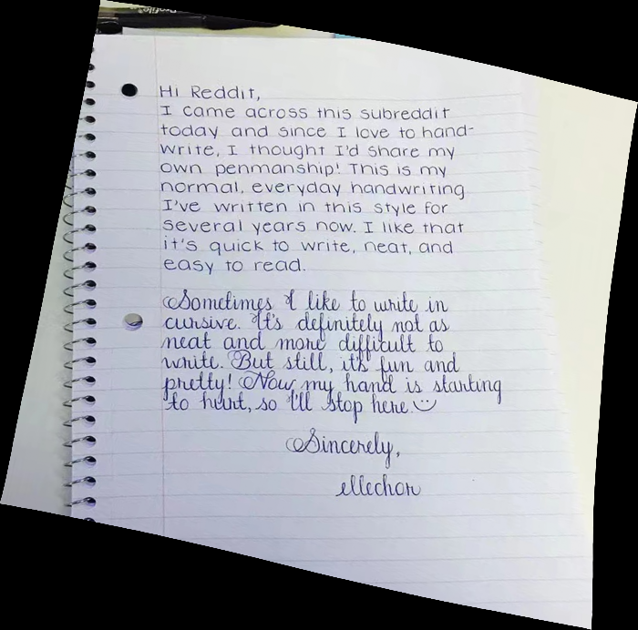

## this code just record first version result for unwarp distorted images and Referenced some codes from https://github.com/fh2019ustc/DocTr-Plus and thanks for sharing.

## this is first version model file:
链接：https://pan.baidu.com/s/16G3ZxPK_Zp8cbxrcM6YfSA 
提取码：oklm

## results of first version:

<div align="center">
     
     
</div>

<div align="center">
     
     
</div>

<div align="center">
     
     
</div>


## How to use 
1. Put the pretrained model to `$ROOT/model_save/`.
2. Put the distorted images in `$ROOT/distorted/`.
3. Run the script and the rectified images are saved in `$ROOT/rectified/` by default.
    ```
    python inference.py
    ```

@inproceedings{feng2021doctr,
  title={DocTr: Document Image Transformer for Geometric Unwarping and Illumination Correction},
  author={Feng, Hao and Wang, Yuechen and Zhou, Wengang and Deng, Jiajun and Li, Houqiang},
  booktitle={Proceedings of the 29th ACM International Conference on Multimedia},
  pages={273--281},
  year={2021}
}

